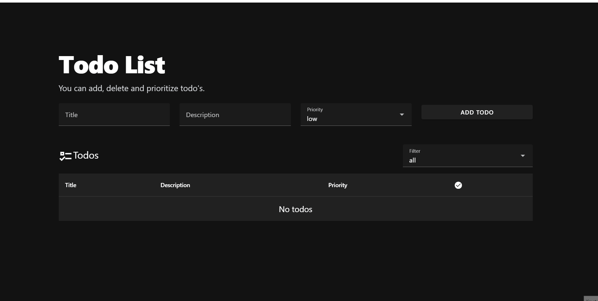
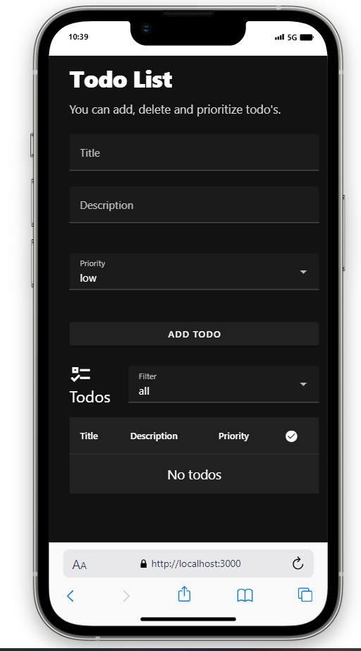
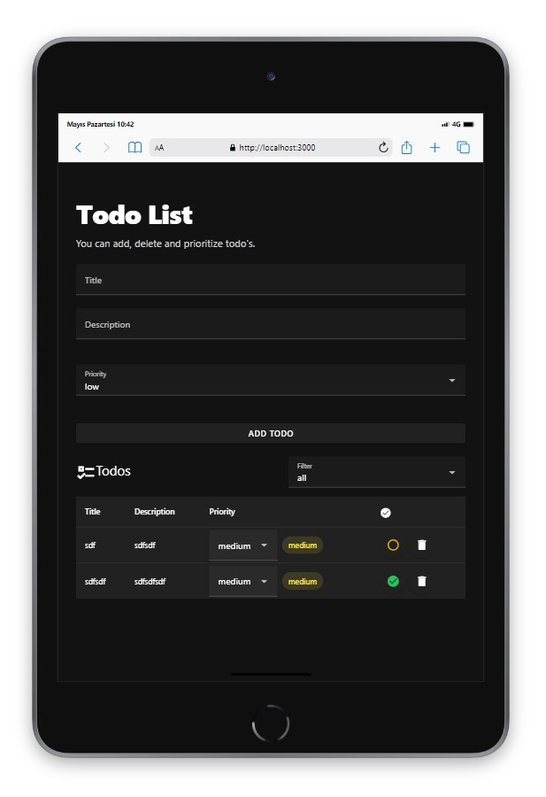

# Vue.js Todo Projesi

Bu proje, [Vite](https://vitejs.dev/) kullanılarak oluşturulmuş bir Vue.js uygulamasıdır. Vite, hızlı bir geliştirme deneyimi sunan bir JavaScript aracıdır.







## Başlangıç

Projeyi yerel ortamınıza klonlayın:

```bash
git clone https://github.com/IRONSTONE-A/vue-tasks.git
cd vue-tasks

```

## Gerekli bağımlılıkları yüklemek için

```bash
npm install
```

## Projeyi başlatmak için

```bash
npm run dev
```

Tarayıcınızda http://localhost:3000 adresine giderek uygulamayı görebilirsiniz.

## Komutlar

npm run dev: Geliştirme modunda uygulamayı başlatır.
npm run build: Uygulamayı üretim için derler.
npm run serve: Üretilen uygulamayı yerel bir sunucuda çalıştırır.


## Sunucuya Yükleme

 Projeyi bir sunucu üzerinde deploy etmek için  birkaç adım izlemeniz gerekmektedir. Aşağıda, projenizi bir sunucuya deploy etmek için sırasıyla izlemeniz gereken genel adımları gösteren talimat bulunmaktadır. Ancak, kullanacağınız sunucu ve ortama bağlı olarak bazı adımlar değişebilir.

### Sunucuya Bağlanma
Projeyi deploy edeceğiniz sunucuya SSH veya başka bir yöntemle bağlanın. Örneğin, SSH kullanarak bağlanmak için:

```bash
ssh kullanici@sunucu-ip-adresi
```

### Proje Dosyalarını Sunucuya Yükleme
Projeyi bilgisayarınızdan sunucuya kopyalayın. SFTP veya SCP gibi araçlar kullanabilirsiniz, ya da rsync komutunu kullanarak dosyaları kopyalayabilirsiniz.

```bash
rsync -avz -e "ssh" /local/proje/dizini kullanici@sunucu-ip-adresi:/sunucu/proje/dizini
```

Burada /local/proje/dizini bilgisayarınızdaki projenin dizinini, /sunucu/proje/dizini ise sunucudaki hedef dizini temsil eder.

### Sunucuda Gerekli Bağımlılıkları Yükleyin

Sunucuda projeniz için gerekli bağımlılıkları yükleyin. 

```bash
cd /sunucu/proje/dizini
npm install
```

### Projeyi Başlatma veya Derleme

Projeyi başlatma veya üretim ortamı için derleme yapma adımlarını gerçekleştirin. 

```bash
npm run build
```

### Sunucuda Projeyi Başlatma

```bash
npm run dev
```

### Firewall ve Port Ayarları

Sunucu üzerindeki güvenlik duvarı (firewall) ayarlarını ve projenin çalıştığı portun açık olduğunu kontrol edin. Projeyi hangi port üzerinde çalıştırıyorsanız, o portun sunucu üzerinde açık olduğundan emin olun.